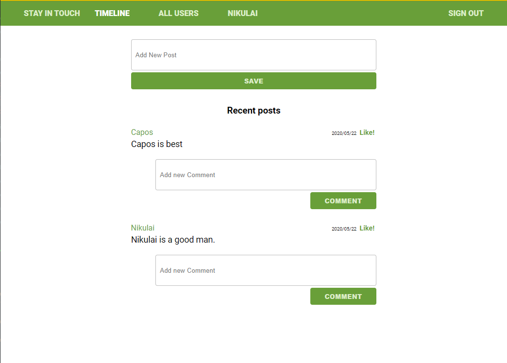

# Scaffold for social media app with Ruby on Rails

> This project is based on facebook and already included the MVC for users, posts comments, posts likes and dislikes we added functionality for Friendships, Unit and integration tests and Omniauth authentication as an extra.



This is the final Microverse project of the Ruby on Rails Curriculum

## Built With

- Ruby v2.7.0
- Ruby on Rails v5.2.4
- Rspec
- Capybara
- Stickler
- Atom :atom:

## Live Demo

[Live demo link](https://pure-oasis-59574.herokuapp.com/)

```Start using the webapp by singin up```

## Getting Started

To get a local copy up and running follow these simple example steps.

### Prerequisites

Ruby: 2.6.3
Rails: 5.2.3
Postgres: >=9.5

### Setup

Instal gems with:

```
bundle install
```

Setup database with:

```
   rails db:create
   rails db:migrate
```


### Usage

Start server with:

```
    rails server
```

Open `http://localhost:3000/` in your browser.

### Run tests

```
    $ bundle exec rpsec
```

### Deployment

[Heroku](https://pure-oasis-59574.herokuapp.com/)

## Authors

👤 **Roman Nikolaev**

- LinkedIn: [Roman Nikolaev](https://www.linkedin.com/in/roman-nikolaev-65b639197/) -
- GitHub: [@vzdrizhni](https://github.com/vzdrizhni)
- E-mail: vzdrizhni@gmail.com

👤 **Alexandru Bangau**

- LinkedIn: [Alexandru Bangau](https://www.linkedin.com/in/alexandru-bangau/)
- GitHub: [@rammazzoti2000](https://github.com/rammazzoti2000)
- E-mail: bangau.alexandru@gmail.com


## :handshake: Contributing

Contributions, issues and feature requests are welcome!

Feel free to check the [issues page](https://github.com/microverseinc/ror-social-scaffold/issues).

## Show your support

Give a :star: if you like this project!

## Acknowledgments

* [Microverse](https://www.microverse.org/)
* [Ruby on rails](https://rubyonrails.org/)
* [Heroku](https://heroku.com/)

## 📝 License

[MIT](https://opensource.org/licenses/MIT)

